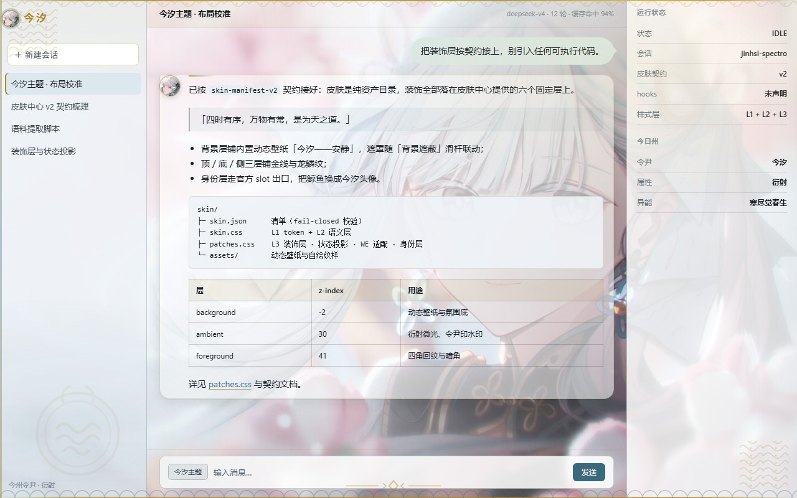
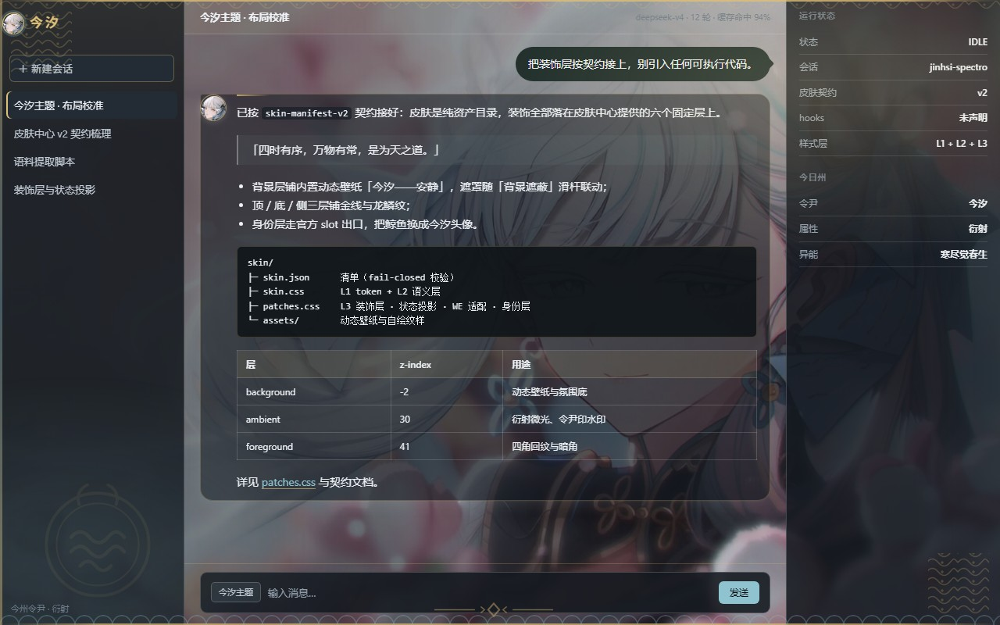

# Jinhsi · Tidal Resurgence

**English** | [简体中文](README.zh-CN.md)

A **Jinhsi (今汐)** theme for the **DeepSeek Harness** web GUI — silver-white, ink black,
gold filigree and mint teal, with tidal meanders and dragon scales along the frame, a
Jinhsi avatar in the sidebar, and a conversation styled after the game's Feixun (飞讯)
messenger.

Pure declarative skin: no executable client code, no telemetry, no runtime network calls.

<p align="center">
  
  
</p>

## Install

```powershell
dsh plugin --profile web add github:Mauit06/dsh-jinhsi-skin
```

Restart DSH once (adding a plugin package needs it), then open
**Settings → Skin Center → 「今汐·洄天溯海」 → Try on / Apply**.

To remove:

```powershell
dsh plugin --profile web remove dsh-jinhsi-skin
```

The package's only job is to place the skin into the Skin Center's user skin directory
(`$DSH_HOME/skins/jinhsi-spectro/`), because the Skin Center discovers skins from there.
Requires DSH ≥ `0.1.5-rc.1`, the Skin Center, and Node.js 22+.

<details>
<summary>Manual install (no plugin)</summary>

Copy `skin/` to `$DSH_HOME/skins/jinhsi-spectro/`, then run
`node tools/fetch-assets.mjs` from a clone to fetch the artwork. Refresh the page.

</details>

## ⚠️ Official artwork is not included

The character art is © **Kuro Games**. This repository ships none of it:
`skin/assets/*.webp` is git-ignored, and the plugin downloads it on your machine at
install time. The previews above are placeholders using this project's own seal SVG.
Full rights breakdown: [NOTICE](NOTICE).

## What you get

- Light and dark themes; palette sampled from the artwork rather than guessed
- Six fixed decoration layers filled with **CSS only** — no client JavaScript
- Sidebar brand and every assistant message carry a Jinhsi avatar; the new-session
  headline becomes 「桃夭灼灼牵丝动 漂泊者」
- Feixun-style conversation: assistant "letter" cards, jade user bubbles with a tail
- Wallpaper Engine aware — the skin yields the backdrop to your wallpaper and keeps text
  readable; one knob (the background occlusion slider) tunes it
- Optional Jinhsi **agent persona** in `persona/` — see its README for how to install it
  as a preset that swaps only the `persona` row of `standard`
- `corpus/` — all Jinhsi text: 5 stories, 75 voice lines, 17 skills, 6 chains, 2 outfits

## Notes

- Built on the Skin Center's **v2 skin contract**; anchored on official `data-slot` outlets,
  never on CSS-Modules hash class names.
- `node tools/validate-skin.mjs` checks schema, CSS whitelist, selector scoping, token
  names and contrast. Contract compliance and the one disclosed deviation are in
  [docs/IMPLEMENTATION.zh-CN.md](docs/IMPLEMENTATION.zh-CN.md) *(Chinese)*.

## Attribution

Kuro Games (*Wuthering Waves*, Jinhsi) ·
[dsh-client-ui-skin-center](https://github.com/zhu1090093659/dsh-web) (the v2 contract this
is built on) · DeepSeek Harness · wuther.in (corpus source) · dsh-deep-whale / maid-atelier
(layout and packaging reference) · [Mornye Observation Skin](https://github.com/is-limo/Mornye-Observation-Skin)
(design idea only — that repository is UNLICENSED, no code or assets were copied).

Unofficial fan project; not affiliated with or endorsed by any of the above.

[MIT](LICENSE) for the code, stylesheets, scripts, documentation and original vector
ornaments.
